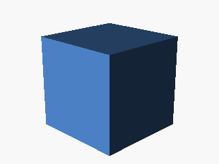
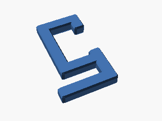
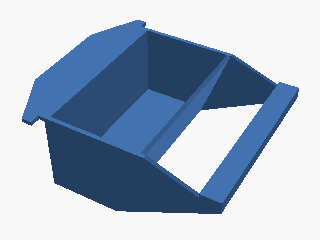
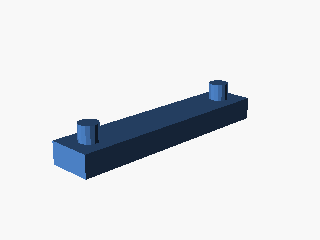
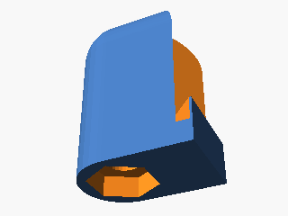
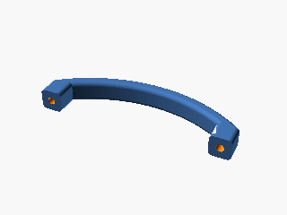

# openSCAD

My personal openSCAD projects/scripts. All slicing configurations are optimized for [Geeetech  MeCreator 2](http://www.geeetech.com/wiki/index.php/MeCreator_2_Desktop_3D_Printer) 3D printer.

## Requirements 

* Downlad and install OpenSCAD from [http://www.openscad.org/downloads.html](http://www.openscad.org/downloads.html).
* Download and install Slic3r from [https://slic3r.org/download/](https://slic3r.org/download/).

## Content

### Cube
Simple 10x10 cube for printer/filament calibration.

### Towel hanger
Simple and functional towel hanger for a oven handle. Very useful.

### Birds feeder
Small birds feeder small-medium cages.

### MeCreator 2 vertical spacer
Vertical spacer for MeCreator 2 3D printer compensating glass height during extruder auto positioning.

### MeCreator 2 adjustable feet
Adjustable feet for MeCreator 2 3D printer.

### Kitchen doors handle

